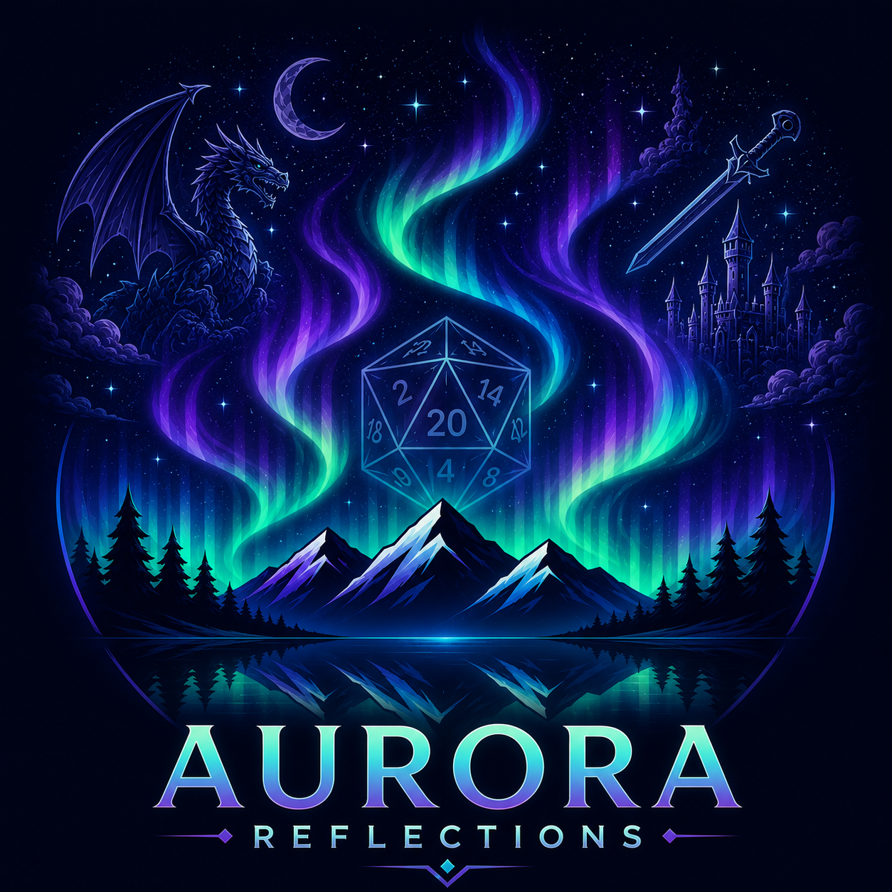
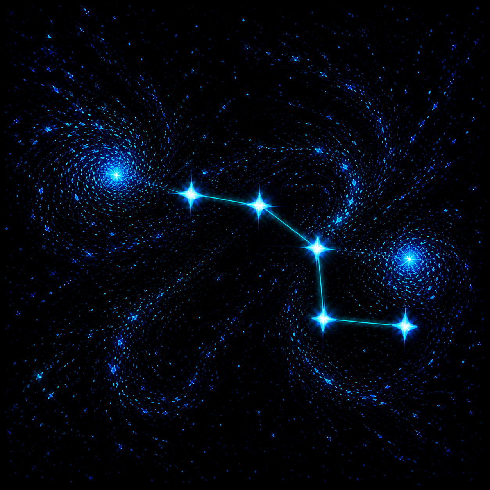

# Aurora Suite Working-Title Logos

These are the currently accepted logo directions and working product names for
three related Aurora projects. The names are not yet intended to force technical
repository, package, executable, or namespace renames. During the transition,
the working titles and their older names can be used interchangeably. The new
names are nevertheless the likely basis for public branding from this point
forward.

The colon styling used below (`Aurora: Reflections`) is the preferred branded
form; ordinary prose may omit the colon.

## Aurora: Reflections

**Represents:** the modern character-building client in `Aurora.App`.

**Older or technical names:** Aurora Lights, Aurora, and `Aurora.App`, depending
on context. `Aurora-Lights` remains the repository and solution name;
Reflections identifies the modern client rather than replacing the umbrella,
while `Aurora.Legacy` identifies the retained WPF client.

**Why Reflections:** the client carries the legacy Aurora experience into a new
interface while continuing to reflect its characters, content, and history. It
also describes the player's character as a reflection of their imagination.
The logo reinforces both meanings by placing familiar fantasy imagery and an
aurora above a mirrored landscape.

## Aurora: Constellations

**Represents:** the project currently known as Aurora XML Helper or
`AuroraXMLHelper`.

**Why Constellations:** the project gathers separate pieces of source material
and helps turn them into a recognizable, coherent structure, much as scattered
points of light become a constellation. The logo intentionally avoids literal
XML or document imagery: chaotic motes swirl and condense into a partially
formed Big Dipper, emphasizing pattern, assembly, and a structure still taking
shape.

## Aurora: Transpositions

**Represents:** the project currently known as Aurora Translator or
`5eApiTranslator`.

**Why Transpositions:** the project expresses source content in another form
while preserving its underlying meaning. *Transposition* captures that purpose
more precisely than a purely decorative celestial name, while remaining poetic
and following the plural cadence of Reflections and Constellations. The logo
shows a coherent auroral signal progressively shearing into luminous fragments:
the same information being re-expressed in a different representation.

## Usage During the Naming Transition

- Use Reflections, Constellations, and Transpositions for conceptual and
  outward-facing branding where the newer identity is useful.
- Continue using Aurora Lights for the repository and solution, Aurora Legacy
  for the retained WPF client, and the older Aurora XML Helper and Aurora
  Translator names where technical clarity requires them.
- Treat both name sets as valid references to the same projects until explicit
  repository, package, executable, and documentation renames are undertaken.
- These files record the accepted logo directions; they do not by themselves
  change any runtime icon, application identity, or build configuration.

## Asset Record

| Working title | File | Resolution |
| --- | --- | --- |
| Aurora: Reflections | `aurora-reflections.png` | 1254 x 1254 |
| Aurora: Constellations | `aurora-constellations.png` | 1254 x 1254 |
| Aurora: Transpositions | `aurora-transpositions.png` | 1254 x 1254 |
